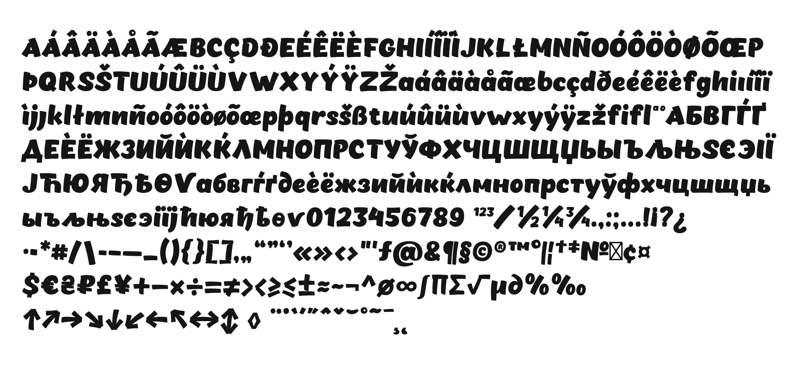

<picture>
  <source media="(prefers-color-scheme: dark)" srcset="cover-dark.png">
  <source media="(prefers-color-scheme: light)" srcset="cover-light.png">
  
</picture>

# OT Chekharda free font v1.005

[Download font: otf, fft and woff](build/)

[Source: UFO, glyphs ](src/)

<picture>
  <source media="(prefers-color-scheme: dark)" srcset="charset-dark.png">
  <source media="(prefers-color-scheme: light)" srcset="charset-light.png">
  
</picture>

## License
OT Chekharda font is free and open sourced under the SIL Open Font License.